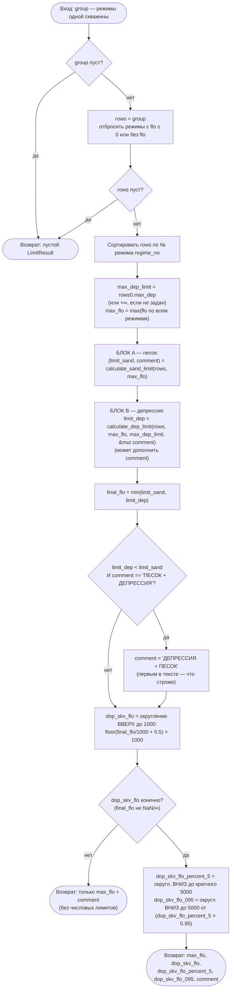
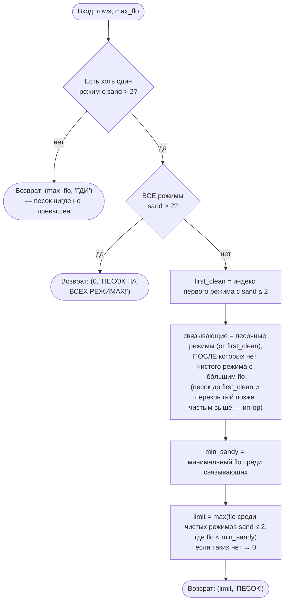
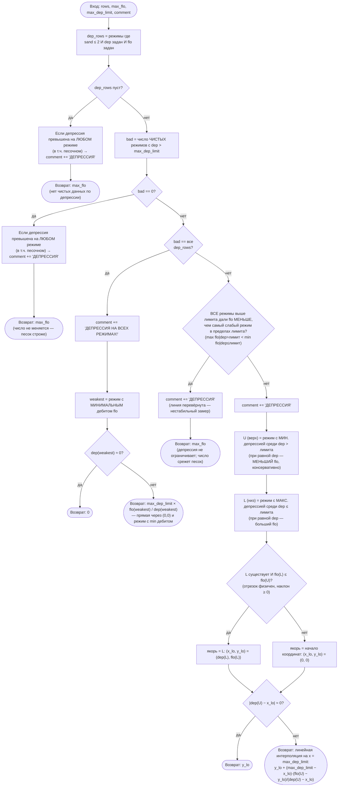

# Блок-схема алгоритма выбора максимально допустимого дебита (ГДИ)

Источник истины — `src/modes/gdi_limits.rs` (`calculate_limits` + вспомогательные
`calculate_sand_limit` и `calculate_dep_limit`).

Итоговый максимально допустимый дебит = **минимум** из двух ограничений:
ограничения по выносу песка (`SAND ≤ 2`) и ограничения по депрессии (`DEP ≤ MAX DEP`).
Каждое ограничение считается независимо, затем берётся более строгое.

Диаграммы ниже — на языке Mermaid (рендерятся в GitHub / VS Code / любом просмотрщике Markdown
с поддержкой Mermaid). Под каждой диаграммой — словесное пояснение шагов.

---

## 1. Верхний уровень — `calculate_limits(group)`

**Пояснения:**

1. Пустая группа → пустой результат.
2. Режимы с нулевым/отсутствующим дебитом отбрасываются сразу — они не несут информации
   и «отравили» бы интерполяцию депрессии.
3. Режимы сортируются по номеру (`regime_no`) — порядок проведения важен для логики песка.
4. `max_dep_limit` берётся из первого (по номеру) режима; `max_flo` — максимум дебита по всем режимам.
5. Считаются два ограничения (Блок A и Блок B); `final_flo` — их минимум.
6. Если строже оказалась депрессия и комментарий был «ПЕСОК + ДЕПРЕССИЯ», порядок слов
   переставляется на «ДЕПРЕССИЯ + ПЕСОК» (первым — более строгое ограничение).
7. Если `final_flo` нечислов (нет ни одного ограничения, остался NaN) — возвращается только
   `max_flo` и комментарий. Иначе считаются производные округлённые величины.

---

## 2. БЛОК A — ограничение по песку `calculate_sand_limit(rows, max_flo)`

Порог: `sand > 2.0` (`MAX_SAND`). Режимы — в порядке проведения. Идея: безопасный дебит —
это **максимальный чистый дебит, оставшийся строго ниже связывающего песка** (`min_sandy`).
Песочный режим связывает, только если **после него скважина чисто на больший дебит уже не
выходила**: позже есть чистый режим выше → ранний песок транзиентный (разовый вынос) и НЕ
ограничивает. Песок ДО первого чистого режима — начальная промывка, не считается.

**Пояснения:**

- **Нет песка** (`sand > 2` нигде) → ограничение не работает, возвращается `max_flo`, комментарий `ГДИ`.
- **Песок на всех режимах** → безопасного дебита нет: `0`, комментарий `ПЕСОК НА ВСЕХ РЕЖИМАХ!`.
- **Частично:** находим первый чистый режим. Песок до него — начальная промывка, не считается.
  Песочный режим **связывает** только если после него скважина чисто на больший дебит уже не
  выходила; если позже есть чистый режим выше — этот песок был разовым выносом и со счёта
  снимается. `min_sandy` — наименьший дебит среди связывающих песочных режимов. Безопасный
  дебит — наибольший чистый дебит **строго ниже** `min_sandy` (чистые режимы учитываются
  независимо от позиции, в т.ч. «хвостовые»).

---

## 3. БЛОК B — ограничение по депрессии `calculate_dep_limit(rows, max_flo, max_dep_limit, comment)`

Порог: `dep > max_dep_limit`. Рассматриваются только **чистые** режимы (`sand ≤ 2`, есть `dep` и `flo`);
песочные ограничены Блоком A. Функция также дополняет `comment`.

**Пояснения:**

- **Нет чистых режимов с депрессией** → возврат `max_flo` (число по депрессии не ограничивается).
- **Депрессия на чистых режимах в норме** (`bad == 0`) → возврат `max_flo`.
- В обоих случаях выше **число не меняется**, но если депрессия была превышена на *любом*
  режиме (включая **песочный** — он и так ограничен Блоком A), в комментарий добавляется
  «ДЕПРЕССИЯ» (напр. `ПЕСОК` → `ПЕСОК + ДЕПРЕССИЯ`). Так в отчёте видно, что депрессия
  выходила за предел, хотя ограничивающим осталось правило по песку.
- **Депрессия на всех режимах** (`bad == все`): нет ни одной точки ниже лимита, чтобы
  ограничить отрезок. Строится прямая через начало координат `(0,0)` и режим с **минимальным
  дебитом** `(flo_min, dep_min)`, снимается на лимите: `max_dep_limit × flo_min / dep_min`.
  Это самая консервативная (нижняя) огибающая. *(Именно min ДЕБИТ, не min депрессия.)*
- **«Перевёрнутая» линия** (есть точки выше лимита, но **все** они дали дебит меньше самого
  слабого режима в пределах лимита): индикаторная линия растёт с депрессией, а затем единично
  «проваливается» — это нестабильный замер, а не реальный потолок. Депрессия не ограничивает
  число (возврат `max_flo`, дальше его срежет песок), но «ДЕПРЕССИЯ» в комментарий добавляется.
  Пример — скв. со скриншота: единственный режим выше лимита (dep 4.47) дал 83600 < 98200
  (минимум в пределах лимита); число задаёт песок (166000), комментарий «ПЕСОК + ДЕПРЕССИЯ».
- **Депрессия превышена частично** — интерполяция между двумя точками индикаторной линии:
  - **U** — верхняя точка: режим с минимальной депрессией среди превышающих лимит
    (при равной депрессии берётся **меньший дебит** — консервативная нижняя оценка).
  - **L** — нижняя точка: режим с максимальной депрессией среди не превышающих лимит.
  - Если `L` существует и отрезок физичен (`flo(L) ≤ flo(U)`, дебит не падает с ростом
    депрессии) → якорь в `L`. Иначе якорь в `(0,0)` (отрезок к `L` был бы убывающим/нефизичным).
  - Дебит читается линейной интерполяцией якорь→U на `x = max_dep_limit`.

---

## 4. Округления на выходе

| Величина | Правило |
|---|---|
| `dop_skv_flo` | вверх до 1000: `floor(v/1000 + 0.5) × 1000` |
| `dop_skv_flo_percent_5` | вниз до кратного 5000 |
| `dop_skv_flo_095` | вниз до 5000 от `dop_skv_flo_percent_5 × 0.95` |

---

## 5. Ключевые нюансы

- **Режимы с `flo ≤ 0`** отбрасываются ещё до расчётов (не участвуют ни в песке, ни в депрессии).
- **Итог = `min(песок, депрессия)`** — самое строгое из двух ограничений; порядок слов в
  комментарии отражает, что строже.
- **`max_dep_limit`** берётся из режима с наименьшим `regime_no`; если `+∞` — депрессия не
  ограничивает (`bad == 0`).
- **Песочные режимы исключаются** из расчёта депрессии (ими занят Блок A); при равной депрессии
  берётся режим с бо́льшим дебитом (верхняя огибающая индикаторной линии).
- **Якорь в `(0,0)`** используется, когда нижней точки нет или отрезок к ней убывающий
  (нефизичный) — даёт консервативную прямую через начало координат.
